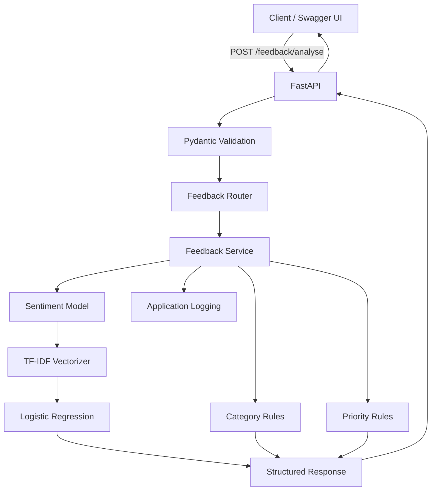

# Customer Feedback Intelligence API

A production-style machine learning API for analysing customer feedback using sentiment classification, category detection and priority identification.

The project demonstrates how a trained NLP model can be packaged behind a tested, containerised and deployed FastAPI service with automated CI.

## Features

- Customer feedback analysis through a REST API
- Machine-learning sentiment classification
- Feedback category detection
- Priority identification
- Pydantic request and response validation
- Structured application logging
- Automated testing with pytest
- Docker containerisation
- GitHub Actions continuous integration
- Public deployment on Render
- Interactive Swagger/OpenAPI documentation

## Example

### Request

```json
{
	"feedback": "I was charged twice and support has not replied."
}
```

### Response

```json
{
	"sentiment": "negative",
	"category": "billing",
	"priority": "high"
}
```

## Architecture



## Machine Learning Pipeline

The sentiment classifier uses a scikit-learn pipeline consisting of:

```text
Customer Review
      ↓
TF-IDF Vectorisation
      ↓
Logistic Regression
      ↓
Positive / Negative
```

The TF-IDF vectorizer uses unigram and bigram features to convert customer review text into numerical representations.

The Logistic Regression classifier then predicts whether the review expresses positive or negative sentiment.

## Dataset

Sentiment training uses the Cleanlab Amazon Reviews dataset.

Training data originally contained:

| Sentiment | Samples |
| --------- | ------: |
| Positive  |   3,092 |
| Negative  |   1,908 |

The positive class was downsampled to create a balanced training dataset:

| Sentiment | Samples |
| --------- | ------: |
| Positive  |   1,908 |
| Negative  |   1,908 |

The original 1,000-row test dataset was kept untouched for evaluation.

## Model Performance

The sentiment classifier achieved:

| Metric      | Result |
| ----------- | -----: |
| Accuracy    |  95.1% |
| Macro F1    |  95.0% |
| Negative F1 |  94.4% |
| Positive F1 |  95.7% |

The model was evaluated on 1,000 unseen test reviews.

## API Endpoints

### `GET /`

Returns basic information about the API.

### `GET /health`

Health-check endpoint used to verify that the application is running.

### `GET /model/info`

Returns information about the deployed sentiment model.

### `POST /feedback/analyse`

Analyses customer feedback and returns sentiment, category and priority.

## Project Structure

```text
customer-feedback-intelligence/
│
├── app/
│   ├── api/
│   │   └── feedback.py
│   ├── core/
│   │   └── logging_config.py
│   ├── models/
│   │   └── sentiment_model.py
│   ├── services/
│   │   └── feedback_service.py
│   ├── main.py
│   └── schemas.py
│
├── data/
├── evaluation/
│   └── metrics.json
│
├── models/
│   └── sentiment_model.joblib
│
├── training/
│   ├── inspect_data.py
│   └── train_sentiment.py
│
├── tests/
│   ├── test_api.py
│   └── test_feedback_service.py
│
├── .github/
│   └── workflows/
│       └── ci.yml
│
├── Dockerfile
├── requirements.txt
└── README.md
```

## Running Locally

Create and activate a virtual environment:

```bash
python3 -m venv venv
source venv/bin/activate
```

Install dependencies:

```bash
pip install -r requirements.txt
```

Start the API:

```bash
uvicorn app.main:app --reload
```

Open Swagger documentation:

```text
http://127.0.0.1:8000/docs
```

## Testing

Run the automated test suite with:

```bash
python -m pytest -v
```

Tests cover the feedback service, API endpoints and request validation.

## Docker

Build the Docker image:

```bash
docker build -t customer-feedback-api .
```

Run the container:

```bash
docker run -p 8000:8000 customer-feedback-api
```

The API will then be available at:

```text
http://localhost:8000
```

## Continuous Integration

GitHub Actions automatically runs the pytest suite when code is pushed to the `main` branch or when a pull request targets `main`.

The CI workflow:

```text
Push / Pull Request
        ↓
GitHub Actions
        ↓
Ubuntu Runner
        ↓
Python 3.10
        ↓
Install Dependencies
        ↓
Run pytest
        ↓
Pass / Fail
```

## Deployment

The application is containerised with Docker and deployed as a web service on Render.

Live API:

`https://customer-feedback-intelligence-ernh.onrender.com`

Interactive API documentation:

`https://customer-feedback-intelligence-ernh.onrender.com/docs`

## Technology Stack

- Python
- FastAPI
- Pydantic
- scikit-learn
- Pandas
- Joblib
- pytest
- Docker
- Git
- GitHub Actions
- Render

## Future Improvements

Potential extensions include:

- replacing rule-based category detection with a trained multi-class classifier
- confidence scores for model predictions
- batch feedback analysis
- model monitoring and latency metrics
- LLM-based feedback summarisation
- drift detection and model versioning
